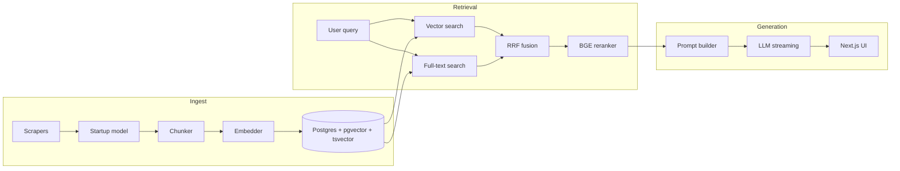

# StartupIndex

Question answering over 116 Indian startups, where every claim carries a citation
back to the chunk it came from.

**[Live demo](https://startupindex.prayagtushar.xyz)** · no signup

Retrieval is written from primitives. No LangChain, no Ragas, no DeepEval.
Vector search and Postgres full-text search feed RRF fusion, then a BGE
cross-encoder, then streaming generation. The evaluation harness is hand-rolled
too, and that is the part that earned its keep.

## The finding

I built the sophisticated pipeline first, then measured it against plain vector
search. Plain vector search won.

| Mode | hit@5 | recall@5 | MRR |
|---|---|---|---|
| **vector** | **0.839** | **0.825** | **0.756** |
| hybrid | 0.613 | 0.583 | 0.632 |
| hybrid+rerank | 0.774 | 0.755 | 0.748 |

The cross-encoder also costs 7,033 ms against 145 to 155 ms for everything before
it combined, roughly 45 times the rest of the pipeline.

The category split shows why. RRF fusion drops direct lookups from 0.917 to
0.667, because keyword hits displace the chunk vector search already had in first
place. The cross-encoder recovers part of that and no more. Fusion is under-tuned
rather than wrong in principle, and tuning its weighting is the obvious next
step.

So the application serves `vector`. The full pipeline survives in `/lab`, where
you can watch all four stages resolve and see where fusion loses ground.

Full numbers, including generation quality and the golden-set breakdown, are in
[EVALUATION.md](EVALUATION.md).


One query, four stages, streamed as each finishes. The arrows track every chunk's
movement against the stage it is meant to improve on.


Every claim carries an inline citation, and the trace panel shows the ranked
candidates behind it. On a question the corpus cannot answer, the model declines
and names the source it checked. It did that on all 10 unanswerable questions in
the golden set.

## Scope

116 startups scraped from Wikipedia's unicorn list and Y Combinator's directory.
Small and verifiable on purpose, not a web-scale index. At this size the
interesting work is measuring retrieval quality rather than scaling it, and every
number is reported as measured, including the ones that contradict the design.

## Design decisions

**No LangChain.** Ranking, fusion and citation behaviour stay under direct
control.

**No Ragas or DeepEval.** The LLM judge calls OpenRouter directly instead of
pulling in the LangChain dependency family for one function.

**One database.** Postgres 16 holds vectors in `pgvector` and keyword indexes in
`tsvector`. Nothing to keep in sync.

**Streaming.** `/chat` sends sources over SSE before generation starts, so the
page fills in as retrieval lands.

## How it works



```
apps/api        FastAPI service
apps/evals      Golden-set runner and LLM judge
apps/ingest     Scrapers, chunking, embeddings
apps/web        Next.js chat UI
packages/retrieval  Retrieval library and DB layer
packages/contracts  TypeScript types generated from OpenAPI
```

`/chat` is open to anyone, so spend is capped server-side by a daily answer
ceiling, per-IP rate limits and bounded request sizes, with a GCP billing budget
as the backstop.

## Stack

Python 3.11, FastAPI, Pydantic v2, psycopg 3, uv. Next.js 16, React 19,
TypeScript 5.9, Tailwind v4, Bun, Turborepo. Postgres 16 with pgvector.
Embeddings and reranking through sentence-transformers, generation through
OpenRouter.

## Run it

Needs Python 3.11+, uv, Bun 1.3.14+, and Docker for local Postgres.

```bash
uv sync
bun install
docker compose -f infra/compose.yml up -d

bun run ingest     # scrape, chunk, embed, load
bun run dev:api    # http://localhost:8000
bun run dev:web    # http://localhost:3000
```

Copy [`.env.example`](.env.example) to `.env` first. Run the evaluation with
`bun run eval`.

## API

| Method | Path | Description |
|---|---|---|
| `GET` | `/health` | Health check, verifies database connectivity |
| `POST` | `/search` | Ranked retrieval results |
| `POST` | `/search/trace` | One SSE event per pipeline stage |
| `POST` | `/chat` | Streaming chat over SSE |
| `POST` | `/feedback` | Store thumbs up or down |
| `GET` | `/startups` | Paginated browser data |
| `POST` | `/ingest` | Stream ingest progress, admin key required |

```bash
curl -N -X POST http://localhost:8000/chat \
  -H "Content-Type: application/json" \
  -d '{"question": "Which Indian fintech unicorn was founded in 2014?", "top_k": 5}'
```

Events are `sources`, then `token` repeatedly, then `done` with the answer and
citations, or `error`.

## Deployment

Cloud Run for the API, Vercel for the web app, Supabase for Postgres. Deployed at
`--min-instances=0` and `--max-instances=1` with no load balancer, so it bills
only while a request runs. Details and the environment variables are in
[AGENTS.md](AGENTS.md).

## License

MIT
